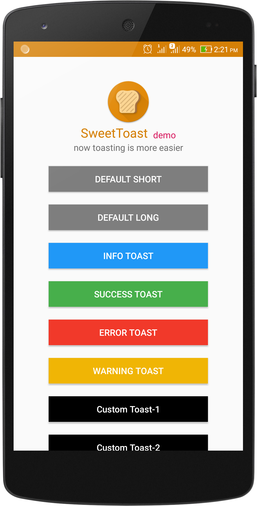

# SweetToast
[](https://jitpack.io/#TheHasnatBD/SweetToast)
 <div align="center">
 	
 </div>
 
### Screenshots of toasts
| default | info | success | warning |
:----------------------:|:----------------------:|:----------------------:|:----------------------:
|||

| error | custom (only text) | custom (only icon) | custom (full) |
:-----------------------:|:-------------------------:|:--------------------:|:-------------------------:
|||
 
## Setup
**Step 1**<br />
Add it in your **root** `build.gradle` at the end of repositories:
```gradle
allprojects {
    repositories {
	...
	maven { url 'https://jitpack.io' }
	}
}
```

**Step 2**<br />
Add the dependency
``` gradle
dependencies {
    ...
    implementation 'com.github.TheHasnatBD:SweetToast:1.0.2'
}
```

## Usage
- [SweetToast Usage Example](https://github.com/TheHasnatBD/SweetToast/blob/master/app/src/main/java/xyz/hasnat/sweettoastlibrary/MainActivity.java)
### Android Default Toast
To display default short Toast-
``` java
SweetToast.defaultShort(context, "YOUR STRING");
```
To display default long Toast-
``` java
SweetToast.defaultLong(context, "YOUR STRING");
```
<br />

### SweetToast Default Toast
(without `duration` parameter, every Default Toast's duration is `Toast.LENGTH_SHORT`)<br />
To display a success Toast-
``` java
SweetToast.success(context, "YOUR STRING");
SweetToast.success(context, "YOUR STRING", duration);
```
To display an info Toast-
``` java
SweetToast.info(context, "YOUR STRING");
SweetToast.info(context, "YOUR STRING", duration);
```
To display a warning Toast-
``` java
SweetToast.warning(context, "YOUR STRING");
SweetToast.warning(context, "YOUR STRING", duration);
```
To display an error Toast-
``` java
SweetToast.error(context, "YOUR STRING");
SweetToast.error(context, "YOUR STRING", duration);
```
<br />

### Custom Toast
( `duration` parameter is must be needed in `custom` method)<br />
(`textColor` takes a int value.
<br /> textColor example- `Color.WHITE` or, `getResources().getColor(R.color.colorWhite)` or `Color.parseColor("#FFFFFF")`)<br />

<br />

To display a partial-custom Toast-
``` java
// Only custom Icon >> in pre-defined backgroundColor and textColor : LightGRAY and BLACK
SweetToast.custom(context, "YOUR STRING", drawableIcon, duration);
```
To display a custom Text Toast without Icon-
``` java
SweetToast.custom(context, "YOUR STRING", textColor, backgroundDrawable, duration);
```

To display a FULLY custom Toast-
``` java
SweetToast.custom(context, "YOUR STRING", drawableIcon, textColor, backgroundDrawable, duration);
```

<br />

``` java

```
 	
### SweetToast Demo App
- [Download App](https://github.com/TheHasnatBD/SweetToast/blob/master/files/SweetToast.zip)
<div>
 	
 </div>
 
<br />

(If you find/face any problem, please open an `issue` or make a `pull request`)

<br />

<div align="center">
</div>
 
